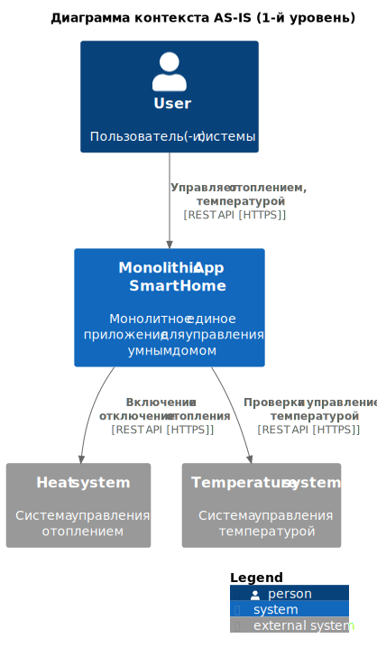
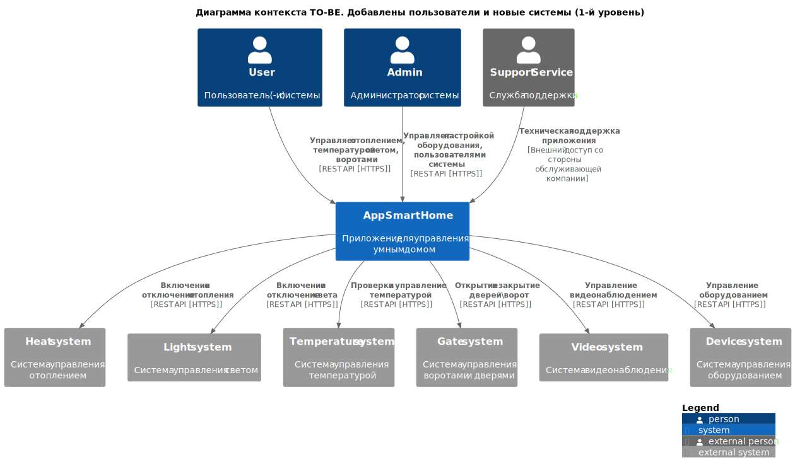
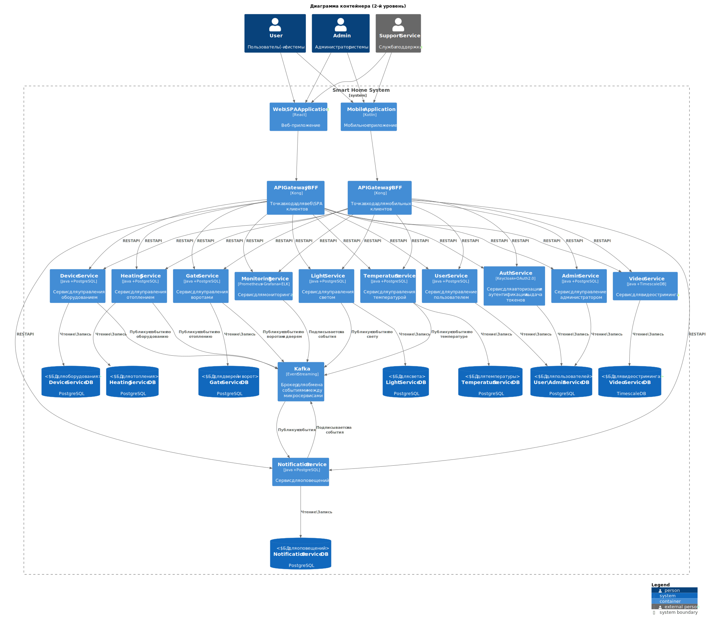

# Описание решения умного дома

# Задание 1. Анализ и планирование

### 1. Описание функциональности монолитного приложения

Согласно текущему решению, приложение включает в себя следующие функциональные блоки:

**Управление отоплением:**

- **Пользователи** могут удаленно включать/выключать отопление в своих домах.
- **Система** поддерживает функционал обработки команд от пользователя на включение и выключение отопления через веб-интерфейс.

**Актуальные API методы**
| Метод    | Эндпойнт | Описание |
| -------- | -------  |-------  |
|GET | /api/heating/{id}| Fetching heating system with id {} |
|PUT | /api/heating/{id}| Updating heating system with id {} |
|POST | /{id}/turn-on | Turning on heating system with id {} |
|POST | /{id}/turn-off| Turning off heating system with id {} |

**Мониторинг температуры:**

- **Пользователи** могут просматривать текущую температуру в своих домах через веб-интерфейс, устанавливать температуру.
- **Система** получает данные о температуре с датчиков, установленных в домах

**Актуальные API методы**
| Метод    | Эндпойнт | Описание |
| -------- | -------  |-------  |
|POST | /{id}/set-temperature| Setting target temperature to {} for heating system with id {} |
|GET | /{id}/current-temperature | Fetching current temperature for heating system with id {} |

### 2. Анализ архитектуры монолитного приложения

* Язык программирования: Java
* База данных: PostgreSQL
* Архитектура: монолитная, все компоненты системы (обработка запросов, бизнес-логика, работа с данными) находятся в рамках одного приложения.
* Взаимодействие: синхронное через REST API, запросы обрабатываются последовательно.
* Масштабируемость: ограничена, монолит масштабирует приложение полностью и сразу.
* Развертывание: требует остановки всего приложения.

### 3. Определение доменов и границы контекстов (Domain, Bounded Context)

Опираясь на текущее решение и целевую модель, по DDD можно выделить следующие домены (domain) и границы контекстов (bounded context):

| Домен    | Контекст |
| -------- | -------  |
| Управление устройствами и интеграциями  | <ul><li>Регистрация устройства</li><li>Подключение и настройка устройства</li><li>Мониторинг устройств</li></ul>   |
| Управление Отоплением | <ul><li>Включение и выключение отопления</li><li>Мониторинг отопления</li></ul>    |
| Управление Температурой  |  <ul><li>Регулирование температуры</li><li>Мониторинг температуры</li></ul>    |
| Управление Пользователем |  <ul><li>Создание пользователя</li><li>Авторизация и аутентификация</li></ul>  |
| Управление Администратором |  <ul><li>Создание администратора</li><li>Авторизация и аутентификация</li></ul>  |
| Управление Светом  |  <ul><li>Включение и выключение света</li><li>Мониторинг электричества</li></ul>    |
| Управление Воротами  |  <ul><li>Открытие и закрытие ворот</li></ul>    |
| Управление Видеонаблюдением  |  <ul><li>Управление видеонаблюдением</li></ul>    |

### **4. Проблемы монолитного решения**
Текущее монолитное решение и его трудности: 

* **Высокий риск ошибок и сильная связанность компонентов**.
    - Изменения в одной части приложения могут непредсказуемо влиять на другие части
    - Ошибки могут полностью остановить работу прилоежния. Критично для SaaS.

* **Длительные циклы разработки и развертывания**
    - При каждом изменении приходится тестировать все приложение целиком. Это замедляет выпуск новых функций
    - Обновление компонентов и доставка нового функционала влечет за собой остановку приложения до полного обновления, может быть критично для SaaS.
    - Добавление нового функционала может потребовать серьезных правок в нескольких частях монолитного приложения
    - В монолите сложно выстроить автоматизированный CI\CD

* **Трудно масштабировать отдельные компоненты системы**
    - С монолитной архитектурой не получится масштабировать только одну часть приложения — придется масштабировать приложение целиком.
    - Масштабирование монолита — большая проблема, когда вырастет количество клиентов, а у компании будут ограниченные ресурсы для расширения.

* **Синхронное взаимодействие**

### 5. Визуализация контекста системы — диаграмма С4

Диаграмма контекста с учетом текущего функционала: централизованное управление отоплением и температурой

**AS-IS**
* [Схема C4 Context UML AS-IS](./diagrams/Context/C4_Context_Smarthome_AS-IS.puml)

---
**TO-BE**
* [Схема C4 Context UML AS-IS](./diagrams/Context/C4_Context_Smarthome_TO-BE.puml)

# Задание 2. Проектирование микросервисной архитектуры

Микросервисы и зона ответственности 
| Микросервис    | Описание |
| -------- | -------  |
|DeviceService | Управление оборудованием: донастройка, регистрация, удаление, подключение  |
|HeatingService | Управление отоплением |
|TemperatureService | Управление температурой |
|UserService | Управление пользователем |
|AdminService| Управление администратором |
|LightService | Управление светом |
|GateService| Управление воротами и дверями |
|VideoService| Управление видеонаблюдением |
|MonitoringService|Мониторинг, сбор метрик, логов|
|AuthService|Авторизация и аутентификация|
|API Gateway|Точка входа для клиентских запросов. Предлагается сделать два gateway: для веб и моб. версии|
|NotificationService|Управление уведомлениями|

----- 

**Диаграмма контейнеров (Containers)**

TO-BE
* [Схема C4 Containers UML](./diagrams/Container/C4_Container_Smarthome.puml)

**Диаграмма компонентов (Components)**

**Диаграмма кода (Code)**

Добавьте одну диаграмму или несколько.

# Задание 3. Разработка ER-диаграммы

Добавьте сюда ER-диаграмму. Она должна отражать ключевые сущности системы, их атрибуты и тип связей между ними.

Четвертое задание — дополнительное. Его можно сделать по желанию. Чтобы ревьюер быстрее проверил ваше решение, укажите, сделали вы это задание или нет. Для этого оставьте нужный эмодзи около заголовка задания:

#  ❌ Задание 4. Создание и документирование API
### 1. Тип API
### 2. Документация API